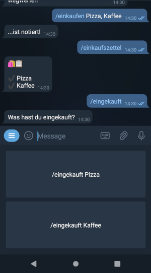

# Flatshare-shopping-list
A telegram bot that implements a simple shared shopping list. The bot only talks German, I do not plan to change that in the future.



## Deploy
It is really easy to deploy:
1. Register a bot to obtain an API key (see [here](https://core.telegram.org/bots))
2. Create a `.env` file:
```bash
cp env.example .env
```
3. Edit `.env` (set your API key, enter the SHA256 hash of your password, set bot name)
4. Deploy docker containers
```bash
docker-compose up -d --build
```
Notice that steps 2-4 must be executed on the server the bot should run on.

When using this setup, the application itself runs in a [distroless](https://github.com/GoogleContainerTools/distroless) Docker container and uses a `redis:alpine` container to store data.
